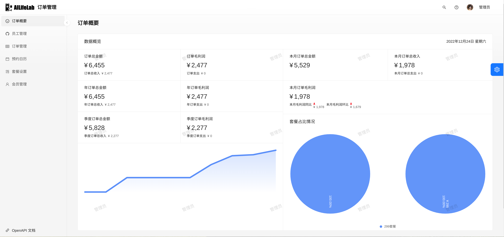
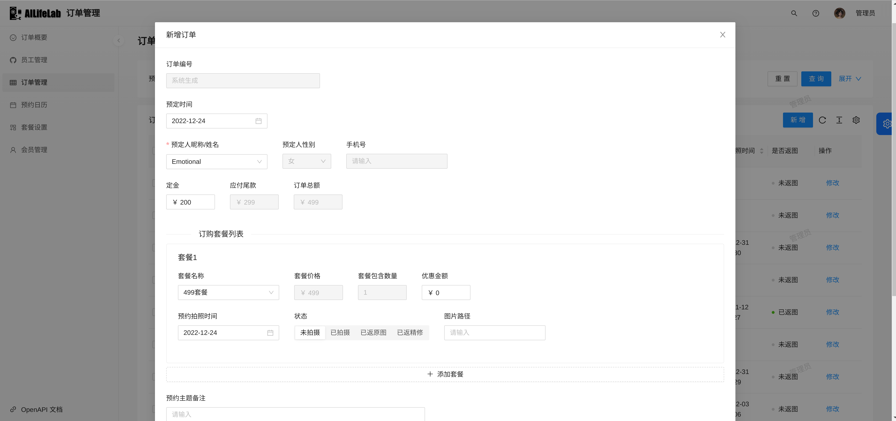

# photography-order
简易的拍照订单系统，基于ant design pro（前端）和springboot（后端）开发      
数据库使用postgresql，缓存使用redis
1. 订单概要：       
进入首页后是对收益的各维度统计，方便对每个月的收益进行大致的了解。      
2. 员工管理：       
是对系统帐号的管理。        
3. 订单管理：       
是本系统核心功能，可以对订单进行操作，并且可以进行拍照预约时间的调整，如果预约的日期有冲突（同一天出现两单或以上的预约）系统会自动提醒。        
4. 预约日历：       
可以通过日历的查看方式查阅最近预约的情况，展示客户的昵称，如果该订单已拍摄，会将状态颜色设置为绿色。        
5. 套餐设置：       
设置套餐的金额和套餐包含的套数      
6. 会员管理：       
更新会员的基础信息      
        

本系统是根据自身需求设计的，更适用于个人摄影工作室/个体工商户对帐目的轻量化管理。如有部署需求（精力有限，只通过本项目更新，不提供额外服务），可邮件联系[dev@ailifelab.org](mailto:dev@ailifelab.org)，仅收取部署产生的劳务费用。